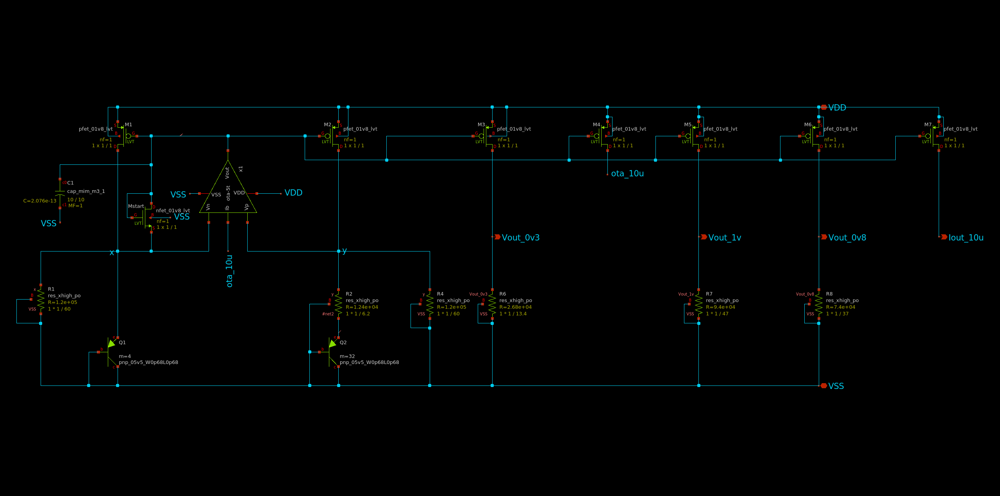
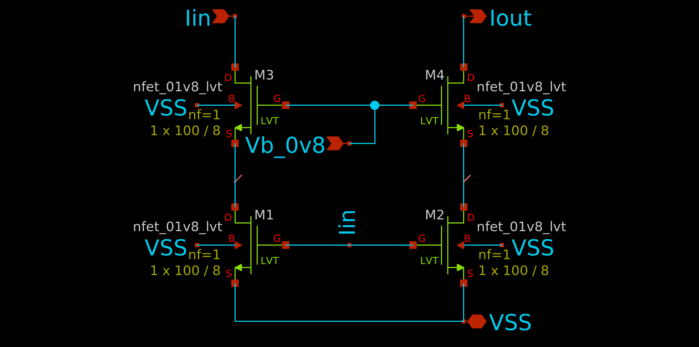
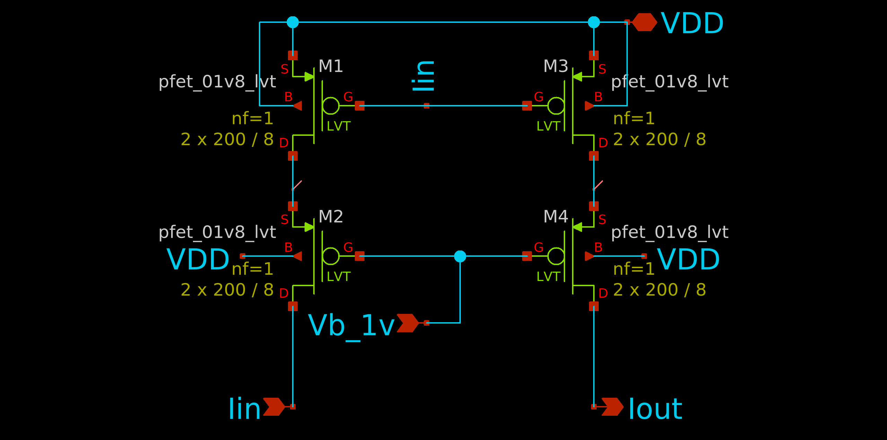

# BandgapRef
Low Voltage Bandgap Reference Circuit and Wideswing Current Mirror in Skywater 130nm Technology

This project includes two Wideswing Current Mirrors (PMOS and NMOS) and a Low Voltage Bandgap Reference Circuit with Constant to Absolute Temperature (CTAT) voltage and current outputs. Users can scale the tail resistor or current mirror width/length to adjust the output voltage or current, respectively.

### Bandgap Reference

### NMOS Wideswing Current Mirror

### PMOS Wideswing Current Mirror

| Metric                                   | Design                        |
|-------------------------------------------|-------------------------------|
| Reference Voltage                        | 300.3 mV, 33.02 ppm/°C        |
| Reference Current                        | 10.17 µA, 32.78 ppm/°C        |
| Output Resistance of NMOS Current Mirror  | 2 MΩ                          |
| Output Resistance of PMOS Current Mirror  | 3.5 MΩ                        |
| Dynamic Range of NMOS Current Mirror      | 0.3 - 1.8 V                   |
| Dynamic Range of PMOS Current Mirror      | 0 - 1.5 V                     |
| Power Consumption                        | 140 µW                        |
| Circuit Start-up                         | 3 µs                          |
